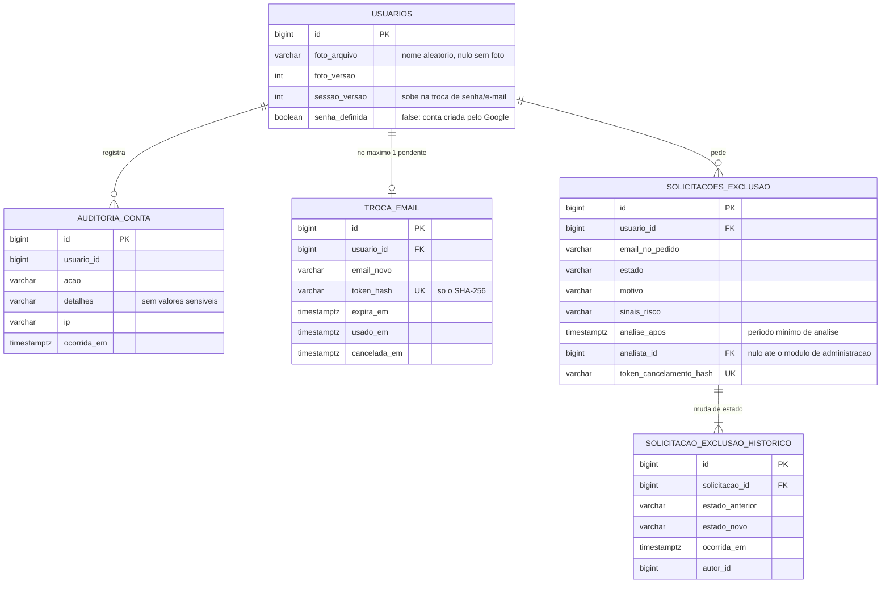
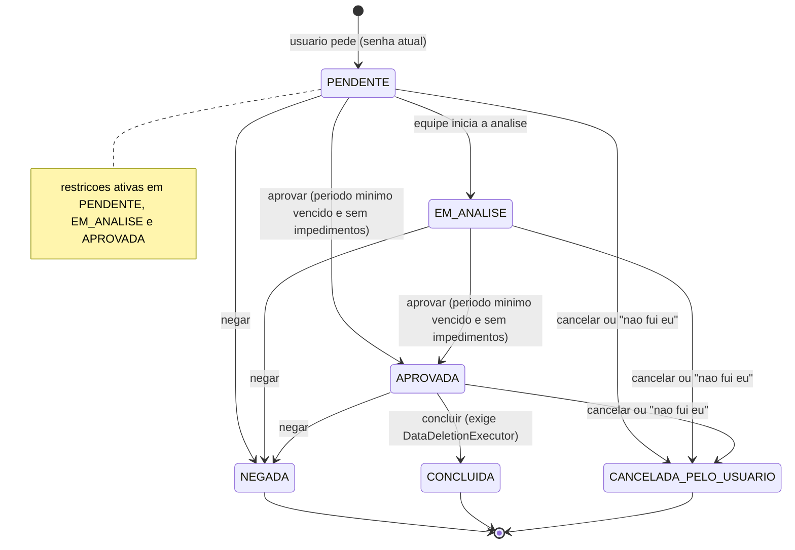
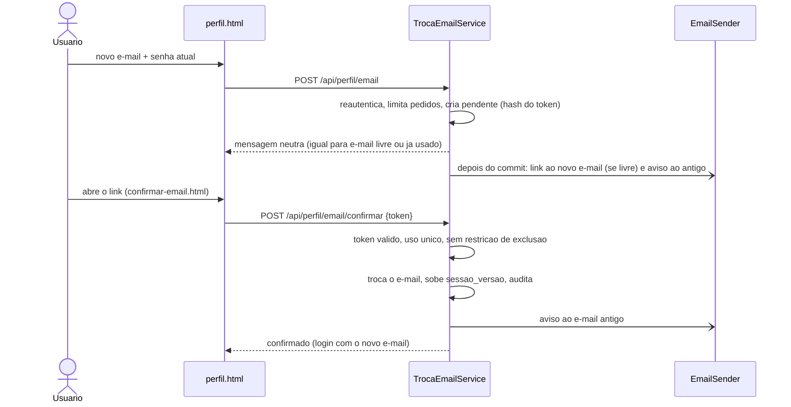

# ADR-005 — Perfil do usuário, segurança da conta e solicitação de exclusão de dados

**Status:** Aceita
**Data:** 2026-10-04
**Contexto do projeto:** SmartRent B2B — Projeto Aplicado IV, UniSENAI/ADS

---

## Contexto

Depois do fluxo de anúncios ([ADR-003](ADR-003-ciclo-de-vida-do-anuncio.md)) e do calendário, SmartChat e
cancelamento ([ADR-004](ADR-004-calendario-smartchat-cancelamento-video-e-fuso.md)), o usuário ainda não tinha
uma área para cuidar da própria conta. Esta ADR registra a página **Meu perfil** (nome, foto, senha, e-mail) e o
pedido de **exclusão de dados** com análise manual e restrições temporárias antifraude. O que já existia e foi
reaproveitado: JWT stateless + BCrypt, `LimitadorDeTaxa`, `MessageFilterService`, `MidiaStorage`, `Clock` central,
`TextosPoliticas` (textos provisórios em um arquivo único) e o padrão de testes com H2.

## Decisões

1. **Cabeçalho e rota.** O cabeçalho já era um componente compartilhado (`header-auth.js`, preenchido em
   `#areaAuth` de todas as páginas). Avatar + nome viraram **um único `<a href="/perfil.html">`** (foco visível,
   hover, `aria-label="Abrir meu perfil"`; Enter funciona por ser link); o botão Sair continua separado e fora do
   link. A foto aparece quando existe e, se falhar, volta às iniciais. O nome entra sempre por `textContent`.
   `/perfil.html` sem login redireciona ao login com `redirectTo`.
2. **Nada de id de usuário.** Nenhum endpoint de `/api/perfil` recebe id (URL, query ou corpo); tudo age sobre o
   usuário autenticado (`@AuthenticationPrincipal`), o que elimina IDOR por construção (teste de reflexão garante).
3. **Nome de exibição = `usuarios.nome`.** Não existia "nome de documento"; reservas já guardam cópia
   (`hospedeNome`/`hospedeEmail`), então trocar nome ou e-mail **não altera reservas**, snapshots nem auditorias
   antigas. Regras: 2–60 caracteres, letras (com acento), números, espaços e `. , ' -`; sem HTML; recusa (não
   mascara) telefone, e-mail, link e termos ofensivos reaproveitando o `MessageFilterService` do chat.
4. **Foto de perfil** (`FotoPerfilProcessador`, só JDK/`ImageIO`): tipo real pelos bytes (PNG ou JPEG); tamanho
   (2 MB), dimensão mínima (128 px) e **total de pixels (25 MP) lidos do cabeçalho antes de decodificar** (anti
   *decompression bomb*); orientação EXIF aplicada; recorte quadrado central; redução em etapas até 512×512 (nunca
   amplia); **recodificação sempre em JPEG sem metadados** (EXIF/GPS não sobrevivem) e sobre fundo branco. O
   original não é guardado. Arquivo com nome aleatório de 128 bits em `avatares/`, **uma por usuário** (a anterior é
   apagada **após o commit**; se a transação falhar, descarta-se a nova). Acesso **público** por nome imprevisível
   (o avatar aparece a outros usuários no SmartChat), `Cache-Control` imutável de 1 ano e URL com `?v=` para furar
   cache. Hoje em disco local, atrás de `MidiaStorage` (trocar por Supabase/S3 = outra implementação).
5. **Senha.** Reautenticação com a senha atual (ou, em conta criada pelo Google, que não tem senha conhecida, uma
   credencial do Google verificada no servidor com o mesmo e-mail — nova coluna `senha_definida`). Política da nova
   senha: mínimo 10 (configurável), máximo 72 bytes (limite do BCrypt: recusa em vez de truncar), diferente da atual,
   fora de uma **lista local** de senhas comuns/vazadas (compara sem acento, caixa, símbolos e trocas tipo `4`→`a`,
   e sem números no fim), não repetitiva e sem o e-mail da conta. Nada é enviado a serviços externos. Hash BCrypt
   (o mesmo do cadastro; custo padrão do Spring). Limite de **5 senhas atuais erradas por 15 min** (depois, nem a
   certa vale: 429), com cada recusa auditada em transação própria (sobrevive ao rollback). Senha, hash e token
   nunca entram em log nem na auditoria (`toString` fixo nos DTOs; teste captura os logs).
6. **Sessões.** Não havia como invalidar JWT. Nova coluna `usuarios.sessao_versao` + claim `sv` no token; o filtro
   só aceita o token se `sv` = versão do usuário (token antigo sem a claim vale 0). Trocar senha ou e-mail incrementa a
   versão: **as outras sessões caem** e a sessão atual recebe um token novo. Custo zero extra (o filtro já carrega o
   usuário).
7. **E-mail com verificação.** Pedido com reautenticação; **resposta sempre neutra** (mesma mensagem, mesmo
   pedido pendente na tela e mesmo aviso ao e-mail antigo, exista ou não conta com o endereço; só o link ao novo
   endereço deixa de ser enviado quando ele já está em uso, e o token então é descartado). Token de 256 bits, validade
   de 1 h (configurável), **só o SHA-256 no banco**, uso único, um pendente por usuário (índice único parcial; novo
   pedido substitui). O e-mail só muda ao confirmar o link (que não exige login e reconfere a disponibilidade);
   confirmar sobe a versão de sessão, avisa o endereço antigo e audita. A página do link remove o token da URL e usa
   `referrer: no-referrer`. Envio por `EmailSender` (interface) com implementação que **só registra em log** hoje; o
   corpo (com o link) só vai ao log com `EMAIL_LOG_CORPO=true` (padrão de desenvolvimento).
8. **Solicitação de exclusão de dados.** **Nada é excluído automaticamente.** O pedido exige a senha atual,
   cria `solicitacoes_exclusao` (`PENDENTE`) com histórico de estados, e-mail do titular no pedido, motivo
   opcional, IP e **sinais de risco** (e-mail/senha alterados recentemente, IP novo — o login passou a auditar o IP —,
   reservas vigentes como cliente e como gestor, anúncios ativos, reembolsos não concluídos, denúncias abertas; só
   sim/não e contagens). Antifraude: e-mail ao titular com a lista de ações restritas e o link **"Não fui eu"**;
   **período mínimo de análise** (`DATA_DELETION_MIN_REVIEW_HOURS`, 48 h) antes de qualquer aprovação; e-mail à equipe
   (`DATA_DELETION_NOTIFY_EMAIL`, só ID e sinais, sem dados pessoais); limite de 3 pedidos por dia; uma solicitação em
   andamento por usuário (índice único parcial no banco). Os e-mails saem **depois do commit** e falha de envio nunca
   desfaz o pedido.
   - O link "Não fui eu" abre uma **página estática que só cancela com um clique (POST)**, em vez de um GET que
     cancela: um leitor automático de e-mail que apenas abre o link não cancela nada.
   - Estados: `PENDENTE`, `EM_ANALISE`, `APROVADA`, `NEGADA`, `CONCLUIDA`, `CANCELADA_PELO_USUARIO`. "Aberta" (o que a
     equipe ainda analisa) = `PENDENTE` e `EM_ANALISE`; **"em andamento"** acrescenta `APROVADA`: enquanto a exclusão
     aprovada não é concluída valem as restrições e não se abre outro pedido (por isso o índice único cobre os três).
   - `DataDeletionReviewService` (aprovar, negar, concluir, iniciar análise) existe **sem tela nem endpoint**, pronto
     para o módulo de administração. **Aprovar** exige o período mínimo vencido e **nenhum impedimento** (reserva
     futura ou em andamento como cliente ou gestor, reembolso pendente ou com falha, denúncia aberta contra o usuário,
     conversa com disputa — a única noção de disputa que existe é denúncia aberta); a lista de impedimentos volta na
     exceção. `DataDeletionExecutor` é só uma interface (a execução é decisão do jurídico): sem um bean, **concluir
     recusa e nada é tocado**.
9. **Restrições temporárias** (`AccountRestrictionService`, **único ponto de decisão**; desligáveis por
   `DATA_DELETION_RESTRICTIONS_ENABLED=false`). Valem enquanto a solicitação está em andamento:
   - *Cliente*: não cria reserva nova (nem pré-visualiza ou **paga uma pendente**, que confirmaria uma reserva nova) e
     não altera o e-mail.
   - *Gestor*: seus anúncios **não aceitam novas reservas** (mensagem genérica ao cliente, sem revelar o motivo; a
     disponibilidade pública mostra o período inteiro indisponível), não publica nem republica (inclusive a
     republicação **automática** agendada: o anúncio fica agendado e é retomado quando as restrições terminam), não
     confirma alteração e não altera o e-mail. O anúncio continua listado (leitura nunca é restringida).
   - *Nunca restritos*: login, leitura, troca de senha, cancelar a própria solicitação, reservas confirmadas,
     cancelamentos e reembolsos (inclusive o do gestor com reembolso integral), descartar edição, editar rascunho,
     bloqueio de datas e SmartChat. Confirmar um link de troca de e-mail pedido **antes** do pedido de exclusão também é
     recusado (o token segue válido até o pedido acabar, ser cancelado ou o link vencer).
   - Início e fim das restrições são auditados; o aviso fixo ("Há uma solicitação de exclusão em análise. Algumas ações
     estão temporariamente indisponíveis.") aparece no perfil e nos painéis e é genérico para não afirmar restrições
     que não existem. Um teste garante que os fluxos passam pelo serviço central e que só ele (e os serviços do
     próprio pedido) conhece o repositório das solicitações.
10. **Auditoria de conta.** Nova tabela `auditoria_conta` (a de anúncio é por imóvel): nome, foto, senha (inclusive
    recusas), e-mail (pedido e confirmação), exclusão (pedido, cancelamento, decisão), início/fim de restrições e
    login (IP), com usuário, ação, IP e instante em UTC, **sem valores sensíveis**.
11. **CSRF.** A autenticação é por `Authorization: Bearer` (não por cookie), então o `csrf.disable()` existente
    continua adequado; os dois endpoints públicos (confirmar e-mail e cancelar exclusão) são protegidos pelo token de uso único.
12. **Rate limits** em memória (`LimitadorDeTaxa`; uma instância): senha atual errada 5/15 min, pedidos de e-mail 3/h,
    exclusão 3/dia, envio de foto 10/h, confirmações por IP 20/h. Com várias instâncias, trocar por um limitador
    distribuído com a mesma interface.

## Modelo de dados (migration V14)

Índices únicos parciais: `uk_troca_email_pendente` (um pedido de troca pendente por usuário) e `uk_exclusao_aberta`
(uma solicitação em andamento — `PENDENTE`, `EM_ANALISE` ou `APROVADA` — por usuário).

## Estados da solicitação de exclusão

## Sequência — troca de e-mail

## Consequências

- Reservas, snapshots e auditorias antigas não mudam com nome ou e-mail; o chat mostra o nome e a foto atuais.
- Contas Google antigas continuam com `senha_definida = true` (a migration não tem como saber): quem entrou só pelo
  Google e quer definir senha ainda não tem esse caminho (fica para a recuperação de senha, fora do escopo).
- O login passou a gravar um evento de auditoria com IP (insumo do sinal "IP novo"); não há fingerprint de dispositivo.
- Os e-mails saem por um *log* enquanto não houver SMTP; não há como confirmar entrega real.
- Aprovar a exclusão **não executa** a exclusão. A execução (o que apagar, o que reter por lei, tratamento de reservas,
  conversas e logs) é ponto de extensão sem implementação.

## Pontos que dependem do jurídico (apenas listados; nenhum foi decidido aqui)

Todos os textos desta entrega estão em `textos-pendentes-juridico.properties`, marcados como provisórios.

- Texto do modal e do e-mail de pedido de exclusão (alcance do pedido, verificação adicional de identidade, retenção
  obrigatória por lei) e do e-mail ao cancelar pelo link.
- **Período mínimo de análise** (hoje 48 h, configurável) e tempo de resposta ao titular.
- Prazos de **retenção**, base legal e o que anonimizar ou reter (`DataDeletionExecutor`), inclusive tratamento de
  reservas, conversas e logs.
- Aviso fixo e descrições das **restrições temporárias** (o que pode ser restringido durante a análise).
- Textos dos e-mails de segurança (senha alterada, e-mail alterado, pedido de troca) quando citarem direitos do titular.

## Pendências

SMTP real; armazenamento da foto em objeto (Supabase/S3); tela de análise e perfil de administrador; recuperação de
senha; moderação do conteúdo da foto (fora do escopo); rate limit distribuído; testes automatizados do front.
